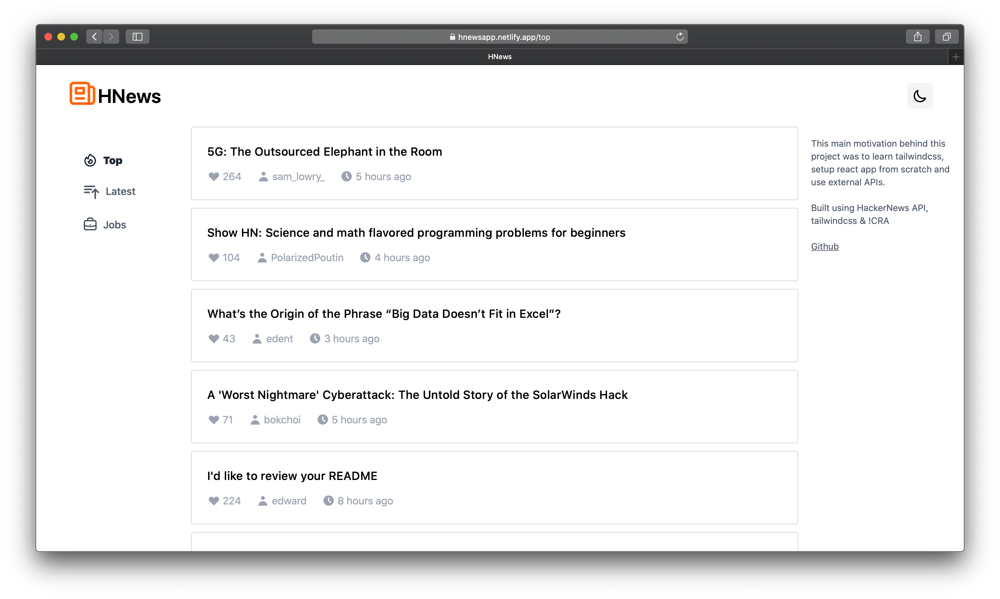
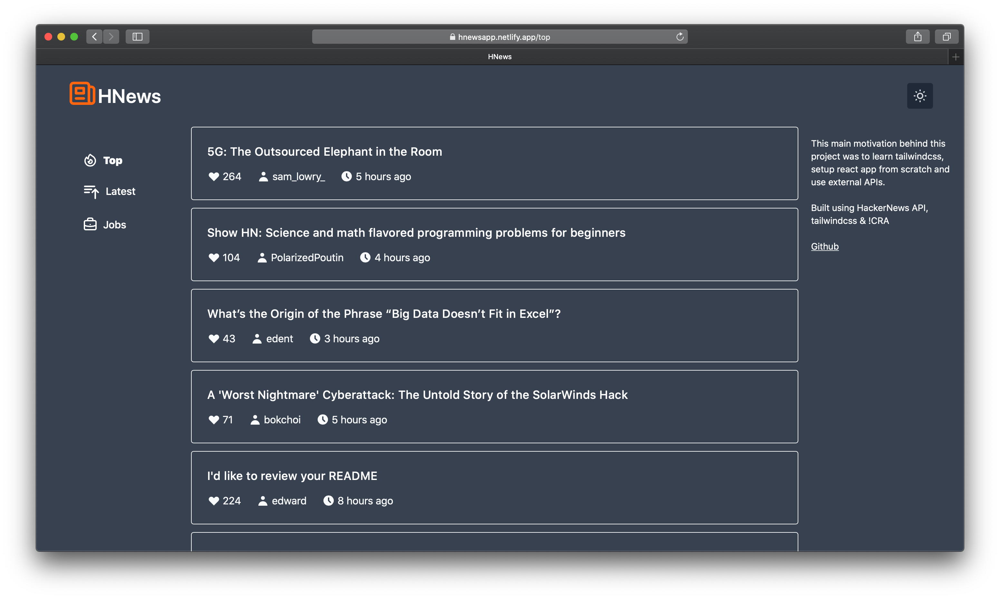

# HNews

 

## App motivation

Hacker News website hasn't been changed from long time. It's difficult to read small text with very less room to breathe. Also there's no dark mode for night reading. Luckily Hacker News API is open which helped to use my tools to build a different Hacker News.

## Technical motivation

After making some apps with CRA(create-react-app), I wanted to try out creating react app from scratch. This helped me learn how to configure webpack.

## Technologies Used

- react
- webpack
- tailwind
- react-router-dom
- dayjs
